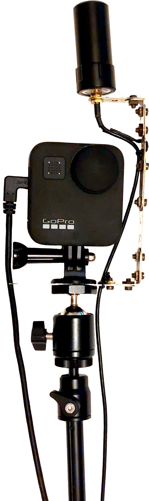

# Tuto GoPro MAX + Sparkfun RTK Express + Panoramax

Bienvenue sur ce tutoriel GoPro MAX + Sparkfun RTK Express + Panoramax. Je vais vous guider afin de configurer tout votre matériel afin de :
- capturer une trace GPX avec le RTK
- capturer des photos 360 avec la GoPro MAX
- corréler les images à la trace GPS
- uploader les photos sur [Panoramax](https://panoramax.openstreetmap.fr)

{: height="500" .center}

## Configuration de la GoPro Max

La configuration est possible soit :
- directement depuis l'écran tactile de la GoPro MAX
- via l'application Android [GoPro Quik](https://play.google.com/store/apps/details?id=com.gopro.smarty)

## Modes de capture GoPro MAX

### Mode piéton

TODO

Références :
- 🇬🇧 [Mapillary : configuration Go Pro MAX](https://help.mapillary.com/hc/en-us/articles/360012674619-GoPro-MAX)