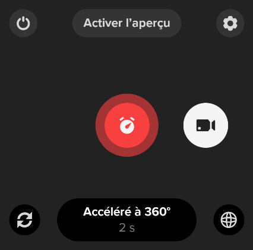
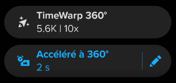

# Tuto GoPro MAX + Sparkfun RTK Express + Panoramax

Bienvenue sur ce tutoriel GoPro MAX + Sparkfun RTK Express + Panoramax. Je vais vous guider afin de configurer tout votre matériel afin de :
- capturer une trace GPX avec le RTK
- capturer des photos 360 avec la GoPro MAX
- corréler les images à la trace GPS
- uploader les photos sur [Panoramax](https://panoramax.openstreetmap.fr)

{: height="500" .center}

## Configuration de la GoPro Max

La configuration est possible soit :
- directement depuis l'écran tactile de la GoPro MAX
- via l'application Android [GoPro Quik](https://play.google.com/store/apps/details?id=com.gopro.smarty)

NB : les instructions et la gestuelle sont similaires.

## Mode photo accélérée

A utiliser pour les piétons 🚶‍♂️, les vélos 🚲 et les voitures 🚗.

1. Choisir le mode "Accéléré à 360°" en swippant l'écran vers la gauche
1. Le mode "Accéléré à 360°" est activé : 
1. Apputer sur "Accéléré à 360°"
1. Le menu est affiché : 
1. Appuyer sur le crayon à droite de "Accéléré à 360°"
1. Renseigner les valeurs suivantes
    - Format : Photo
    - Intervalle : 2s (ou 5s pour avoir moins de photos)
1. Revenir à l'écran principal
1. La GoPro est configurée

## Mode vidéo accélérée (non recommandé)

Voir la page [Mode vidéo](mode_video.md).

## Références
- 🇬🇧 [Mapillary : configuration Go Pro MAX](https://help.mapillary.com/hc/en-us/articles/360012674619-GoPro-MAX)