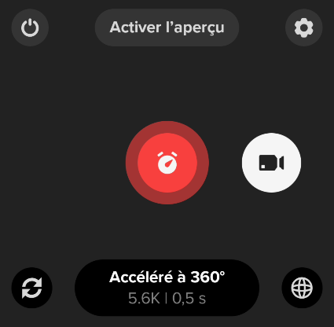
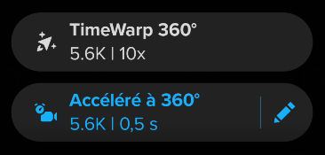

# Mode video

⚠️ Attention ! Ne pas utiliser ! La GoPro produits des fichiers vidéos ".360" qui ne sont pas encore supportés par Panoramax !

Il sera peut-être possible de passer en mode vidéo accéléré et arriver à capturer 1 photo toutes les 1 secondes. Mais il faut extraire les photos de la videos.

La GoPro peut faire des video timelapse avec une frame toutes les 0.5 secondes, mais les données exif sont précises à la seconde et non au centème de seconde. Donc une photo prise à l'intant t et une photo prise à l'intant t+0.5 auront la même date de prise de vue. Ce qui rendra impossible de corréler les 2 images à des positions différentes sur une traces GPS. En bref, ces 2 photos vont se superposer une fois corrélées à la trace GPX.

Je travaille sur un outil pour extraire les frames de ces vidéos en JPG et les tagguer avec la bonne heure de prise de vue. Par la suite, il faudra que je test pour voir si j'arrive bien à corréler tout ça correctement avec une trace GPS.

Pas sûr que le mode vidéo soit vraiment intéressant car la qualité des images prises en mode vidéo timelapse semble bien moindre. J'obtiens au mieux des images de 4096*1344 (5.5 méga pixels) en video timelapse. Contre des images 5760*2880 (16.5 méga pixels). Donc le nombre de pixels par photo est diminué par 3. Donc une grosse perte de qualité. 

1. Choisir le mode "Accéléré à 360°" en swippant l'écran vers la gauche
2. Le mode "Accéléré à 360°" est activé : 
3. Apputer sur "Accéléré à 360°"
4. Le menu est affiché : 
5. Appuyer sur le crayon à droite de "Accéléré à 360°"
6. Renseigner les valeurs suivantes
    - Format : Vidéo
    - Intervalle : 1s
7. Revenir à l'écran principal
8. La GoPro est configurée